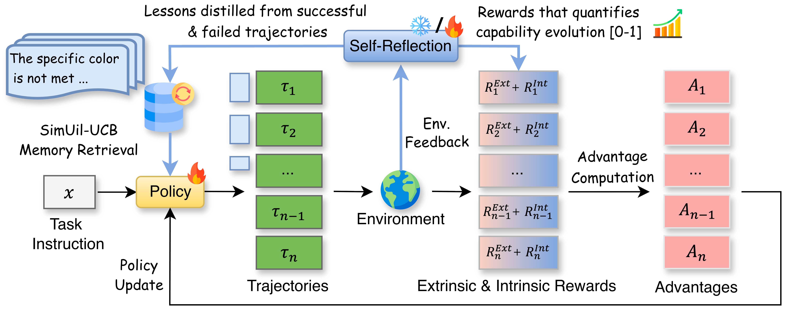

# 🔄 RetroAgent

**RETROAGENT: From Solving to Evolving via Retrospective Dual Intrinsic Feedback**

<p align="center">
  <a href="https://arxiv.org/abs/2603.08561"></a>
  <a href="https://github.com/zhangxy-2019/RetroAgent"></a>
  <a href="LICENSE"></a>
</p>

<p align="center">
  <em>An online RL framework that empowers LLM agents to <strong>evolve</strong> — not just solve.</em>
</p>

---

> ✅ **Update:** The code for RetroAgent with **in-context self-reflection** has been released — enjoy and have fun!  
> 🚧 We are actively organizing the code for RetroAgent with **RL-trained self-reflection**. Stay tuned for the upcoming release!

---

## 📖 Overview

**RetroAgent** is an online reinforcement learning framework that empowers LLM-based agents to master complex interactive environments through continuous self-improvement.

Standard RL paradigms favor static problem-solving over continuous adaptation: agents often converge to suboptimal strategies due to insufficient exploration, while learned knowledge remains implicit within parameters rather than explicitly retrievable. RetroAgent addresses these limitations through a **hindsight self-reflection mechanism** that produces **dual intrinsic feedback**:

- 🔢 **Intrinsic Numerical Feedback** — Tracks incremental subtask completion relative to prior attempts, rewarding promising explorations.
- 💬 **Intrinsic Language Feedback** — Distills reusable lessons into a memory buffer, retrieved via our proposed **Similarity & Utility-Aware Upper Confidence Bound (SimUtil-UCB)** strategy that balances relevance, utility, and exploration to effectively leverage past experiences.

### RetroAgent on-policy RL Training Framework

<p align="center">
  
</p>

---

## 🏆 Key Results

RetroAgent significantly outperforms existing methods across four challenging agentic tasks, achieving **state-of-the-art** results. Compared to GRPO-trained agents:

| Task | Improvement |
|:------------|:-----------:|
| ALFWorld | **+18.3%** |
| WebShop | **+15.4%** |
| Sokoban | **+27.1%** |
| MineSweeper | **+8.9%** |

RetroAgent also exhibits strong **test-time adaptation** and **generalization to out-of-distribution scenarios**, validated across two model families.

> 💡 All experiments were conducted on **4 × NVIDIA H200 GPUs**.

---

## 🚀 Quick Start

### Clone the Repository

```bash
git clone https://github.com/zhangxy-2019/RetroAgent.git
cd RetroAgent
```

### 2. Install veRL (Base Environment)
We recommend using Conda to manage your environment.

```bash
conda create -n verl-agent python==3.12 -y
conda activate verl-agent

pip3 install vllm==0.11.0
pip3 install flash-attn==2.7.4.post1 --no-build-isolation --no-cache-dir
pip install -e .
```

### 3. Install Supported Environments
⚠️ Important: To run an agent in any of these environments, you must first install and configure the corresponding environment. We strongly recommend installing each environment in its own dedicated conda environment to avoid potential package version conflicts.

ALFWorld
```bash
conda env create -f agent-alfworld-env.yaml
bash ./examples/grpo_trainer/run_alfworld_retroagent_grpo_in_context_self_reflection.sh
```


ALFWorld
```bash
conda env create -f agent-alfworld-env.yaml
bash ./examples/grpo_trainer/run_alfworld_retroagent_grpo_in_context_self_reflection.sh
```


Webshop
```bash
conda env create -f agent-webshop-env.yaml
bash ./examples/grpo_trainer/run_webshop_retroagent_grpo_in_context_self_reflection.sh
```


Sokoban
```bash
conda env create -f agent-sokoban-env.yaml
bash ./examples/grpo_trainer/run_sokoban_retroagent_grpo_in_context_self_reflection.sh
```


MineSweeper
```bash
conda env create -f agent-sokoban-env.yaml
bash ./examples/grpo_trainer/run_minesweeper_retroagent_grpo_in_context_self_reflection.sh
```

## 🙏 Acknowledgments
This code is adapted from and built upon several amazing open-source repositories. We sincerely thank the authors and contributors of these projects for sharing their valuable work: verl (https://github.com/verl-project/verl), verl-agent (https://github.com/langfengQ/verl-agent/tree/master), and LaMer (https://github.com/mlbio-epfl/LaMer).

## 📬 Contact
For questions or discussions, please reach out to Xiaoying Zhang at zhangxycuhk@gmail.com.

## 📝 Citation

If you find our work useful, please consider giving us a ⭐ and citing our paper:

```bibtex
@article{zhang2026retroagent,
  title={RetroAgent: From Solving to Evolving via Retrospective Dual Intrinsic Feedback},
  author={Zhang, Xiaoying and Liu, Zichen and Zhang, Yipeng and Hu, Xia and Shao, Wenqi},
  journal={arXiv preprint arXiv:2603.08561},
  year={2026}
}
